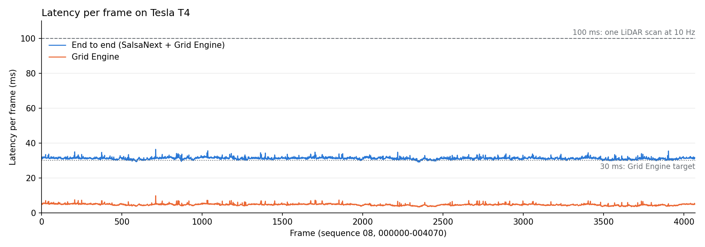
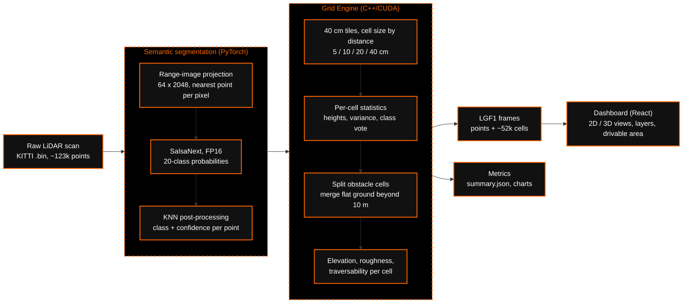
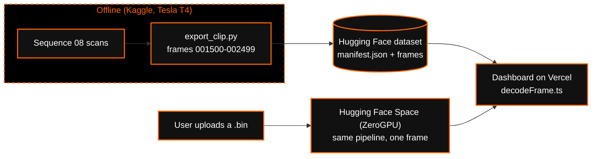

# AS2.5LM

**Real-time semantic 2.5D mapping from LiDAR.** A raw LiDAR scan is labelled point by point
with SalsaNext, then turned into an adaptive 2.5D grid (5 cm cells near the vehicle, up to 40 cm
far away) carrying elevation, roughness, semantic class and traversability for every cell.
The grid engine is written in C++/CUDA and runs in **4.65 ms per frame**; the whole pipeline,
from raw scan to grid, runs in **31.1 ms** on a Tesla T4.

Built for Smart India Hackathon (SIH).

## Results

Full SemanticKITTI sequence 08 (4,071 frames, the model's validation split), Tesla T4.
Details, charts and per-frame data: [`results/`](results/README.md).

| | |
|---|---|
| Grid Engine latency | **4.65 ms** median, 6.66 ms p99 (target < 30 ms) |
| End-to-end latency | **31.1 ms** median, 33.4 ms p99, **32 frames/s** |
| Real-time margin | 100% of frames under 100 ms (one scan of a 10 Hz LiDAR) |
| Segmentation | **mIoU 59.0%**, 89.3% of points correct (FP16 = FP32) |
| Obstacle safety | 0.47% of vehicle / pedestrian points shown as passable |
| Memory and power | ~583 MB GPU memory, 1.8 J per frame |
| CUDA vs reference | Bit-identical grids (checked on every run) |



## Pipeline



How the frames reach the dashboard:



More: [architecture](docs/ARCHITECTURE.md) · [grid engine algorithm](docs/GRID_ENGINE.md) ·
[evaluation metrics](docs/EVALUATION.md) · [frame format](docs/FORMAT.md) · [deployment](docs/DEPLOY.md)

## What each cell contains

| Field | Meaning |
|---|---|
| position, size | footprint of the cell; 5 cm within 10 m, 10 / 20 / 40 cm further out |
| semantic class, confidence | confidence-weighted vote of the points in the cell (19 SemanticKITTI classes) |
| min / max / mean height, variance | elevation statistics of the cell's points |
| terrain complexity | roughness 0-1 from height range and spread |
| traversability | 0 (blocked) to 1 (clear): class weight x (1 - 0.5 x roughness) |
| point count | LiDAR returns in the cell |

## Repository layout

```
src/as25lm/          Python package
  config.py          classes, cell sizes, thresholds (single source of truth)
  segmentation/      SalsaNext wrapper: projection, model, KNN (vendored model code)
  grid/              Grid Engine: NumPy reference + C++/CUDA extension (csrc/)
  pipeline.py        scan -> labels -> grid, with stage timings
  metrics.py         IoU, distance bands, grid accuracy, obstacle safety, GPU power
  frame_format.py    LGF1 frames for the dashboard
  report.py, export.py
scripts/             benchmark, evaluate, report, check_parity, export_clip,
                     convert_weights, build_space, render_figures (slide images)
notebooks/           kaggle_run.ipynb: runs the scripts on a Kaggle T4
space/               Hugging Face Space (live single-frame API)
dashboard/           decodeFrame.ts, drivability.ts (for the React app)
tests/               pytest suite on synthetic scenes (no data needed)
results/             full-run results: summary.json, frame_metrics.csv, figures/
docs/                architecture, algorithm, metrics, format, deployment
```

## Quick start

Requirements: Python 3.10+, PyTorch 2.1+. The CUDA Grid Engine needs an NVIDIA GPU and the
CUDA toolkit (`nvcc`); without them use `--engine numpy` (same output, slower).

```bash
pip install -e ".[eval,export,dev]"
pytest                                   # CUDA parity test is skipped without nvcc
```

Data and weights are not in the repository:

- KITTI odometry velodyne scans and SemanticKITTI labels (sequence 08 for evaluation)
- SalsaNext pretrained model (`pretrained/SalsaNext`, `arch_cfg.yaml`), converted once:

```bash
python scripts/convert_weights.py --checkpoint pretrained/SalsaNext --out weights/salsanext_weights.pth
```

Run the evaluation (Tesla T4 on Kaggle: see [`notebooks/kaggle_run.ipynb`](notebooks/kaggle_run.ipynb)):

```bash
DATA=/path/to/dataset/sequences/08
W=weights/salsanext_weights.pth
python scripts/check_parity.py --scans $DATA/velodyne --weights $W
python scripts/benchmark.py    --scans $DATA/velodyne --labels $DATA/labels --weights $W --out runs/seq08
python scripts/evaluate.py     --scans $DATA/velodyne --labels $DATA/labels --weights $W --out runs/seq08
python scripts/report.py       --results runs/seq08
```

Export the dashboard clip and build the live Space: [docs/DEPLOY.md](docs/DEPLOY.md).

## Demo
- **Frontend Repository:** [point-matrix/connect](https://github.com/point-matrix/connect)
- Dashboard: given in ppt(not shown here for safety purposes)
- Clip data: https://huggingface.co/datasets/ranbyDipz/sih-lidar-clip

## Acknowledgements

- [SalsaNext](https://github.com/tiagoCortinhal/SalsaNext) (Cortinhal et al.): segmentation model,
  KNN post-processing and pretrained weights (MIT; see [THIRD_PARTY_NOTICES.md](THIRD_PARTY_NOTICES.md))
- [SemanticKITTI](http://www.semantic-kitti.org/) and [KITTI](https://www.cvlibs.net/datasets/kitti/): data

## License

Not licensed for reuse at this time. Third-party code keeps its own license (see
[THIRD_PARTY_NOTICES.md](THIRD_PARTY_NOTICES.md)).
