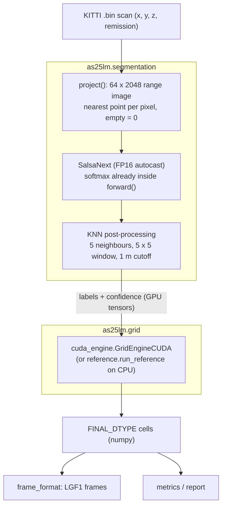
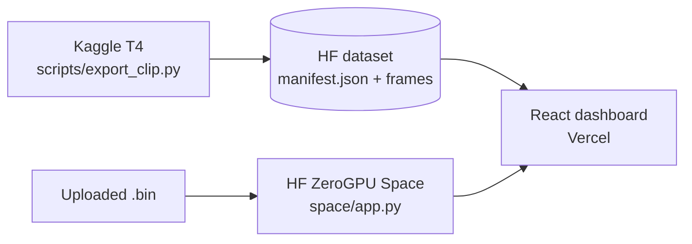

# Architecture

## Components

| Module | Role |
|---|---|
| `config.py` | Every constant: classes, colours, priorities, traversability weights, cell sizes, distance bands, thresholds, sensor and KNN settings, SemanticKITTI label map |
| `segmentation/segmenter.py` | `Segmenter`: projection, SalsaNext, KNN; safe weight loading; optional stage timing |
| `segmentation/salsanext.py`, `knn.py` | Model and KNN from the SalsaNext repository (MIT) |
| `grid/reference.py` | NumPy Grid Engine: the specification; also `cell_index_of_points` |
| `grid/cuda_engine.py` + `grid/csrc/` | C++/CUDA Grid Engine, compiled on first use with `torch.utils.cpp_extension` |
| `pipeline.py` | `Pipeline.process(raw)`: scan → labels → cells, with stage timings |
| `metrics.py` | IoU / mIoU, distance bands, grid-level accuracy, obstacle safety, `PowerSampler` |
| `report.py` | Latency summaries, record frames, charts |
| `frame_format.py`, `export.py` | LGF1 frames and the dashboard clip |
| `data.py` | Reading scans and labels |

## Segmentation fixes

The original inference notebook had several problems, fixed here and verified on real data:

| Problem | Fix |
|---|---|
| Softmax applied twice (SalsaNext's `forward()` already ends with softmax), squashing every confidence to ≤ 0.125 | Model output used directly; confidence now averages 0.93 |
| Empty range-image pixels fed as −1; SalsaNext was trained with 0 | Empty pixels are 0 after normalisation |
| Several points on one pixel: GPU index assignment kept an undefined one | Nearest point kept, ties by lowest index (matches SalsaNext's CPU loader) |
| No KNN post-processing | KNN from the SalsaNext repo: +3.2 mIoU |
| `strict=False` checkpoint loading could hide a wrong file | Strict loading; original checkpoint converted to a weights-only file that loads safely |
| Latency timers included disk reads and zip compression | I/O outside timers, GPU synchronised, warm-up excluded |

## Grid Engine versions

The first Grid Engine was pure Python / NumPy (~212 ms per frame on CPU). The current engine:

- runs in C++/CUDA (4.65 ms per frame on a T4) and stays bit-identical to its NumPy reference;
- uses SalsaNext's class ids (the first version was off by one class);
- assigns cell size per 40 cm tile instead of per point, so cells never overlap and no points are lost;
- uses 5 / 10 / 20 / 40 cm cells, so every level nests exactly;
- computes exact statistics for split and merged cells, and fixed physical roughness limits;
- keeps 5 cm cells within 10 m (no merging there).

Algorithm: [GRID_ENGINE.md](GRID_ENGINE.md).

## Deployment

The Space runs SalsaNext on the GPU and the NumPy Grid Engine on the CPU (ZeroGPU cannot compile
CUDA extensions); both produce the same cells. Steps: [DEPLOY.md](DEPLOY.md).
