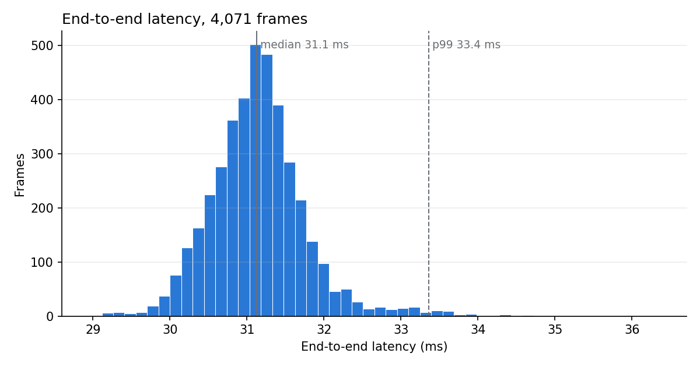
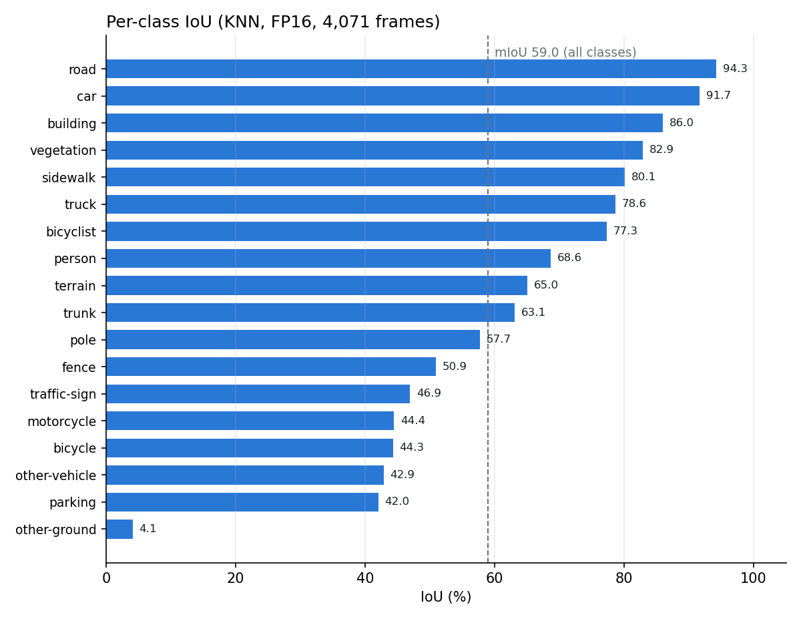
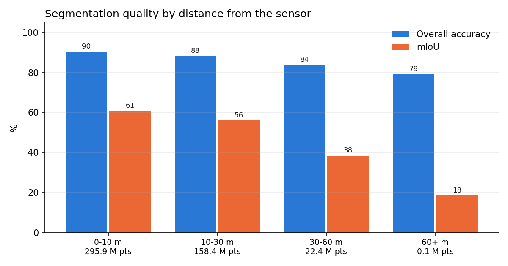

# Results: full SemanticKITTI sequence 08

| Setting | Value |
|---|---|
| Data | SemanticKITTI sequence 08, all 4,071 frames (000000–004070), 499 million points. Sequence 08 is SalsaNext's validation split: the model never trained on it |
| Hardware | Kaggle, NVIDIA Tesla T4 (16 GB), PyTorch 2.10 + CUDA 12.8 |
| Pipeline | SalsaNext in FP16 with KNN post-processing → C++/CUDA Grid Engine → cells copied to the CPU as a numpy array |
| Timing method | Scans read from disk before each timer starts; GPU synchronised at every timestamp; 10 warm-up frames excluded |

Files: [`summary.json`](summary.json) (all headline numbers), [`frame_metrics.csv`](frame_metrics.csv)
(one row per frame: stage latencies, points, cells, accuracy, IoU, obstacle counts),
[`figures/`](figures/). Metric definitions: [docs/EVALUATION.md](../docs/EVALUATION.md).

## Latency

| Stage (ms) | Median | p95 | p99 | Max |
|---|---|---|---|---|
| Scan upload to GPU | 0.61 | 0.69 | 0.75 | 0.98 |
| Range-image projection | 1.26 | 1.86 | 2.15 | 3.35 |
| SalsaNext model (FP16) | 20.99 | 21.29 | 21.41 | 24.15 |
| KNN + per-point labels | 3.58 | 3.81 | 3.93 | 4.59 |
| **SalsaNext total** | **25.86** | 26.53 | 27.00 | 29.58 |
| Grid Engine on GPU | 3.09 | 3.47 | 4.81 | 5.23 |
| Grid Engine copy to CPU | 1.54 | 1.94 | 2.07 | 5.19 |
| **Grid Engine total** | **4.65** | 5.37 | 6.66 | 9.76 |
| **End to end** | **31.12** | 32.19 | 33.36 | 36.35 |

- Every frame finished within 100 ms (one scan of a 10 Hz LiDAR), and every Grid Engine run within 30 ms.
- Jitter (standard deviation): 0.65 ms end to end, 0.53 ms Grid Engine. Slowest frame: 000710.
- GPU memory allocated stayed at 52–55 MB per frame from first to last frame (no growth).




## Throughput, memory and power

| | |
|---|---|
| Throughput, end to end | 3.94 million points/s, 32.1 frames/s |
| Throughput, Grid Engine alone | 26.4 million points/s |
| Peak GPU memory (PyTorch allocated / reserved) | 215 MB / 452 MB |
| CUDA context and libraries | 131 MB, so about **583 MB** of the T4's 14.9 GB in total |
| GPU power | 25.7 W idle, 57.8 W mean while processing |
| Energy | **1.80 J per frame** (0.56 frames per joule) |

Power is the board power read through NVML every 50 ms. Only readings taken while a frame was being
processed count. Individual readings peaked at 90.9 W, above the T4's 70 W limit; short spikes
above the limit can appear in instantaneous readings, so the mean is the figure to quote.

## Segmentation accuracy

| Labels | mIoU | Overall accuracy |
|---|---|---|
| Pixel lookup, FP32 | 55.8% | 87.9% |
| KNN, FP32 | 59.0% | 89.3% |
| **KNN, FP16 (used)** | **59.0%** | **89.3%** |

KNN post-processing adds 3.2 mIoU points; FP16 costs no accuracy. All 19 classes are present
in the sequence, so the mIoU averages all of them (the chart shows 18; `summary.json` lists every class).



Strongest classes: road (94.3%), car (91.7%), building (86.0%). Weakest: other-ground (4.1%),
parking (42.0%) and other-vehicle (42.9%); parking is often labelled as sidewalk.

| Distance from sensor | Accuracy | mIoU | Points |
|---|---|---|---|
| 0–10 m | 90.3% | 60.8% | 295.9 M |
| 10–30 m | 88.2% | 56.0% | 158.4 M |
| 30–60 m | 83.7% | 38.3% | 22.4 M |
| 60 m + | 79.2% | 18.5% (12 classes present) | 0.08 M |



## The grid

| | |
|---|---|
| Grid cells whose class matches the majority ground truth of their points | 87.0% of 166.8 million cells (83.9% by area) |
| By cell size | 5 cm: 89.2%, 10 cm: 72.0%, 20 cm: 83.5%, 40 cm: 84.2% |
| Missed obstacles, vehicles + people | **0.47%** of points (163,439 of 34,987,284) in cells shown as passable |
| Missed obstacles, all obstacle classes | 0.34% (384,888 of 112,059,989 points) |
| False alarms: road / parking shown as blocked | 2.74% (2,569,190 of 93,911,318 points) |

A cell counts as blocked when its traversability is below 0.5.

## Record frames

| Record | Frame | Value |
|---|---|---|
| Highest overall accuracy | 003544 | 97.4% |
| Highest car IoU (≥ 50 car points) | 001533 | 98.8% (9,601 car points) |
| Highest person IoU (≥ 20 person points) | 002101 | 100% (81 person points) |
| Fastest end to end | 002349 | 28.97 ms (SalsaNext 25.15 + Grid Engine 3.35) |
| Stress test: most car + pedestrian points | 003689 | 34,611 car + 8 pedestrian points; 30.28 ms |

Frames 001533 and 002101 are inside the dashboard clip (001500–002499).

## Reproduce

```bash
DATA=/path/to/dataset/sequences/08
W=weights/salsanext_weights.pth
python scripts/benchmark.py --scans $DATA/velodyne --labels $DATA/labels --weights $W --out runs/seq08
python scripts/evaluate.py  --scans $DATA/velodyne --labels $DATA/labels --weights $W --out runs/seq08
python scripts/report.py    --results runs/seq08
```

`python scripts/report.py --results results` redraws the charts in this folder from `summary.json`
and `frame_metrics.csv`. The confusion matrix needs the run's `confusion.npy`, so it is drawn only
when `report.py` runs on the full run folder.
